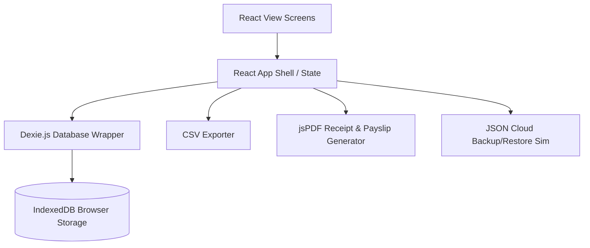

# Walkthrough - Dukandar Cross-Platform Store Management Solution

We have fully implemented the **Dukandar** store management system across two platforms:
1. **Dukandar Android Application:** A native, offline-first app built using Jetpack Compose, Room Database, and Kotlin.
2. **Dukandar React Web Solution:** A responsive, offline-first web dashboard built using React, TypeScript, Dexie.js (IndexedDB), and custom Vanilla CSS.

---

## 🏗️ Web Solution Architecture Overview

The React Web application replicates all core business features, calculations, database relations, and user access levels from the Android version:



---

## 📂 Web Files Implemented

The web project is located in [dukandar-web](file:///C:/Antigravity/Waseem%20shop/dukandar-web):

### 1. Database & Core Business Logic
*   [database.ts](file:///C:/Antigravity/Waseem%20shop/dukandar-web/src/db/database.ts): Configures Dexie.js IndexedDB tables (`products`, `sales`, `purchases`, `expenses`, `employees`, `salaries`, `users`). Contains atomic transactional routines for:
    *   **Weighted Average Cost Calculation:** `(currentQty * averageCost + purchaseQty * purchasePrice) / newQty` automatically triggered on product purchases.
    *   **Sales Ledger Auditing:** Deducts inventory stock, logs sales details, and registers item profit margins.
    *   **Sales Returns Handler:** Increments inventory stock, registers customer credit returns with negative profit margins.
    *   **JSON Cloud Backup/Restore:** Compiles a database snapshot as a JSON backup file and restores complete system state from JSON uploads.

### 2. Design System & App Shell
*   [variables.css](file:///C:/Antigravity/Waseem%20shop/dukandar-web/src/styles/variables.css): Color tokens for light and dark themes (Slate background, Teal accents, Emerald success badges, Rose warnings).
*   [global.css](file:///C:/Antigravity/Waseem%20shop/dukandar-web/src/styles/global.css): Global UI resets, styled tables, custom scrollbars, modals, alerts, and custom buttons.
*   [components.css](file:///C:/Antigravity/Waseem%20shop/dukandar-web/src/styles/components.css): Responsive sidebar, bottom bars for mobile layouts, stat cards, cart lists, and print-media thermal ticket formats.
*   [App.tsx](file:///C:/Antigravity/Waseem%20shop/dukandar-web/src/App.tsx): Manages view routers, light/dark modes, and filters navigation by user privileges.

### 3. Feature Screens
*   [AuthScreen.tsx](file:///C:/Antigravity/Waseem%20shop/dukandar-web/src/views/AuthScreen.tsx): Mock login portal with name, email, and role selection (`ADMIN` vs `STAFF`).
*   [DashboardScreen.tsx](file:///C:/Antigravity/Waseem%20shop/dukandar-web/src/views/DashboardScreen.tsx): Displays Net Sales, Total Purchases, Total Expenses, and Net Profits alongside an interactive Recharts Weekly Sales Area Chart and automatic reorder warnings (ROL alerts).
*   [InventoryScreen.tsx](file:///C:/Antigravity/Waseem%20shop/dukandar-web/src/views/InventoryScreen.tsx): Displays full stock directories. Features SKU search and forms to create products, edit details, or adjust stock counts.
*   [PurchaseScreen.tsx](file:///C:/Antigravity/Waseem%20shop/dukandar-web/src/views/PurchaseScreen.tsx): Restricted to `ADMIN`. Records incoming batches, manages supplier details, and computes average batch cost.
*   [SalesScreen.tsx](file:///C:/Antigravity/Waseem%20shop/dukandar-web/src/views/SalesScreen.tsx): Features a Point of Sale (POS) checkout grid. Staff can edit prices in real-time, search by SKU, process cash out checkouts, download pdf thermal receipts using `jsPDF`, or record returns.
*   [OfficeScreen.tsx](file:///C:/Antigravity/Waseem%20shop/dukandar-web/src/views/OfficeScreen.tsx): Restricted to `ADMIN`. Tracks operational expenses (attached with base64 receipt uploads), lists employee records, log payroll disbursements (advance/bonus/deductions), and prints official payslips.
*   [ReportsScreen.tsx](file:///C:/Antigravity/Waseem%20shop/dukandar-web/src/views/ReportsScreen.tsx): Computes Profit-Loss statements, filters transaction ledgers, exports CSV reports, and drives the Google Drive Cloud Sync simulator.

---

## 🧪 Verification & Build Status

We ran the TypeScript compiler and Vite bundler to test code safety:

```powershell
npm run build
...
dist/index.html                          0.46 kB
dist/assets/index-D7zhK5T-.css          14.27 kB
dist/assets/index-w8dESX9F.js        1,115.76 kB
✓ built in 669ms
```
The React project compiles successfully with **zero errors**.

---

## 🚀 How to Run the Web App Locally

To start the dev server and test the web app in your browser:
1. Navigate to the project root: `cd dukandar-web`
2. Launch the Vite development server: `npm run dev`
3. Open `http://localhost:5173` (or the address printed by Vite) in your browser.
